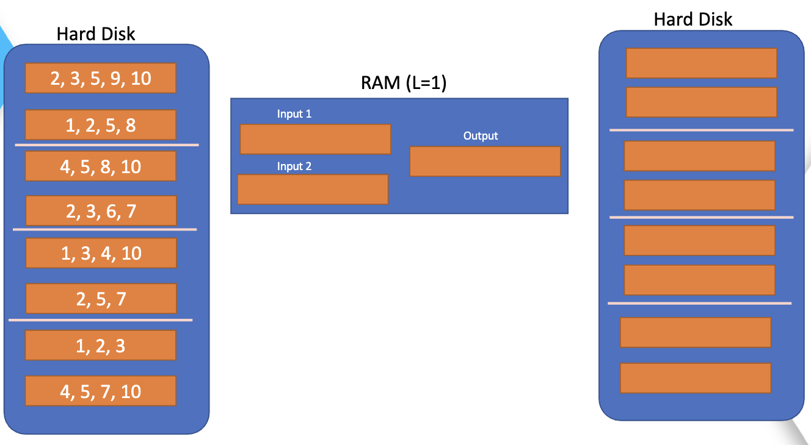

# Indice Invertido

- El indice invertido es una tecnica utilizada en la recuperacion de informacion y de la busqueda de texto, ademas permite una búsqueda eficiente de palabras clave en grandes cantidades de texto.

- En esta implementacion que planteamos, utilizaremos el indice invertio pero en memoria secundaria, por tanto el indice invertido se guardar en varios archivos (bloques), en donde cada archivo contiene un subconjunto de terminos del indice invertido de forma ordenada, esto lo realizamos con el proposito de evitar cargar todo el indice invertido global en memoria principal `(RAM)` y sino mas bien solo cargarlo por bloques.

- Hemos utilizado las tecnicas BSBI `(Block Sort-Based Indexing)` y SPIMI `(Single-Pass In-Memory Indexing)` para la implementacion del indice invertido en memoria secundaria.

## Implementación

- Implementamos la clase `BSBI` la cual tiene como atributos de entradas el tamaño del bloque, el archvivo donde se encuentra la metadata y la fución para calcular el tamaño de cada diccionario, lo cual nos servira al momento de crear los bloques.

``` python
class BSBI:
    def __init__(self, size_block, archivo,funcion_sizeof):
        self.size_block = size_block
        self.num_block = 0
        self.current_block = {}
        self.blocks = []
        self.archivo=archivo
        self.funcion_sizeof=funcion_sizeof
        self.num_books=0
        self.books=[]
```
- El metodo `SPIMI` se divide en etapas, en esta primera lo que hacemos es cargar el archivo con los stopwords, y lo guardamos en una lista.  

``` python
 def SPIMI(self):
        # Cargamos la stoplist
        with open(os.path.join('Indice_invertido', 'stoplist.txt'), encoding='utf-8', ) as file:
                stoplist = [line.rstrip().lower() for line in file]
        stemmer = SnowballStemmer("english") # Verificar si las palabras estan en ingles
```

-  En esta segunda parte se abre el archivo donde se encuntra toda la metadata y se lee linea por linea, luego se preprocesa cada linea, cabe resaltar que tomaremos cada linea como un documento, se calcula el tf (frecuencia en el documento) de cada palabra en cada documento y se añade a un diccionario `self.current_block` el cual funcionara como un bloque.

``` python
        # Abrimos el archivo de metadata
        with open(os.path.abspath(self.archivo)) as f:
            next(f)
            df = pd.read_csv(self.archivo)

            for line in f:

                tokens = [stemmer.stem(word.lower()) for word in nltk.word_tokenize(line) if word.isalpha() and word.lower() not in stoplist]

                # Calculamos el tf, guardaremos solo este valor debido a que el df se calcula en la fase de merge, con todos los bloques

                tf = defaultdict(lambda: defaultdict(int))

                self.books.append(df.loc[self.num_books,"track_id"])
                for token in tokens:
                    tf[token][df.loc[self.num_books,"track_id"]] += 1

                # Añadimos los tf al bloque actual
                for token in tf:
                    if token in self.current_block:
                        for doc in tf[token]:
                            self.current_block[token][doc] += tf[token][doc]
                    else:
                        self.current_block[token] = tf[token]

``` 
- En esta tercera parte lo que hacemos es calcular el tamaño del bloque actual, si el tamaño del bloque actual es mayor al tamaño del bloque que se le ha asignado, entonces se procede a ordenar el bloque actual y se guarda en un archivo, luego se limpia el bloque actual y se repite el proceso hasta que se termine de leer el archivo de metadata, si luego de leer toda la metadata aun queda informacion en el `self.current_block` entonces se carga a un bloque tambien.

``` python
                # Calculamos el tamaño del bloque actual
                size_block = self.funcion_sizeof(self.current_block)

                # Si el tamaño del bloque actual es mayor al tamaño del bloque que se le ha asignado
                if size_block > self.size_block:
                    # Ordenamos el bloque actual
                    self.current_block = dict(sorted(self.current_block.items(), key=lambda item: item[0]))
                    # Guardamos el bloque actual en un archivo
                    self.save_block()
                    # Limpiamos el bloque actual
                    self.current_block = {}
                    # Aumentamos el numero de bloques
                    self.num_block += 1
                self.num_books+=1

        if self.current_block:
            self.num_block += 1
            self.save_block("blocks_index",self.num_block,self.current_block)
            self.blocks.append('block' + str(self.num_block) + '.json')
            self.current_block = {}
```

- En la funcion `save_block()` lo que hacemos es guardar el bloque actual en un archivo, en donde el nombre del archivo es `block` mas el numero del bloque mas la extension `.json`, por ejemplo `block1.json`, `block2.json`, etc.

``` python
        def save_block(self,nombre_carpeta,num_block,bloque):
            # Nombre del archivo dentro de la carpeta
            nombre_archivo = 'block' + str(num_block) + '.json'
            
            # Combinar la carpeta y el nombre de archivo para obtener la ruta completa
            ruta_completa = os.path.join(nombre_carpeta, nombre_archivo)

            # Asegúrate de que la carpeta exista antes de guardar el archivo
            if not os.path.exists(nombre_carpeta):
                os.makedirs(nombre_carpeta)

            with open(ruta_completa, 'w',encoding="utf-8") as f:
                json.dump(bloque, f,ensure_ascii=False, indent=4)    
```


- En el metodo `merge_index()` se aplicaremos como estrategia la agrupacion de los bloques por capas, asegurando así que todos los bloques puedan compararse entre sí y que al final se obtenga un índice invertido global ordenado y dividido en bloques. La capa 0 es la capa inicial, donde cada capa tiene un tamaño de 2^i, siendo i el número de la capa. Por ejemplo, la capa 0 tiene un tamaño de 2^0=1, lo que significa que se agrupará de 1 en 1. La capa 1 tiene un tamaño de 2^1=2, lo que implica agrupar de 2 en 2. La capa 2 tiene un tamaño de 2^2=4, agrupándose de 4 en 4, y así sucesivamente. Es importante destacar que el número total de bloques debe ser una potencia de 2 para que la estrategia pueda aplicarse.



- En esta primera parte se calcula el numero de capaz con las cuales se trabajara, si el numero de capas es 1 entonces se carga el indice invertido global y se guarda en un archivo, si el numero de capas es mayor a 1 entonces se procede a calcular el numero de bloques que se van a agrupar en cada capa, hallando la potencia de 2 mas cercana al numero de bloques pero que sea mayor o igual.
    

``` python
    def merge_index(self):

        num_blocks_merge= self.num_block

        self.num_block = 0

        # Si solo hay un bloque, devolver el índice invertido de ese bloque

        if num_blocks_merge == 1:
            with open("blocks_index/" + self.blocks[0], "rb") as f:
                diccionario= json.load(f)

            self.num_block += 1
            self.save_block("blocks_merge",self.num_block,diccionario)
            return  

        # Divide en dos grupos iguales
        
        final=self.calcular_cuadrado(num_blocks_merge)
        potencia_2=2**final
```
- Como segunda parte se procede a iterar cada capa representada por la variable `p`, luego en cada capa se va iterar por cada grupo de bloques, estableciendo el inicio y final del gupo de la izquierda y derecha, luego se itera por grupo mas pequeño, en donde se va a cargar los bloques de la izquierda `(self.left_merged)` y de la derecha `(self.right_merged)`, luego se va a comparar los bloques de la izquierda y de la derecha, si los dos bloques se quedan vacios entonces se carga el siguiente bloque de la derecha y se repite el proceso, si el bloque de la izquierda se queda vacio entonces se carga el siguiente bloque de la izquierda y se repite el proceso, si el bloque de la derecha se queda vacio entonces se carga el siguiente bloque de la derecha y se repite el proceso, si ninguno de los bloques se queda vacio entonces se procede a comparar los terminos de los bloques de la izquierda y de la derecha, luego se procede a guardar el diccionario ordenado en un archivo, luego se limpia el diccionario ordenado y se repite el proceso hasta que se termine de comparar todos los bloques de la capa actual, luego se procede a comparar los bloques de la siguiente capa y se repite el proceso hasta que se termine de comparar todos los bloques de todas las capas.

``` python
        for p in range(0,final):
                    b=2**p
                    bloques_inicio_izquierda=0
                    bloques_inicio_derecha=b
                    self.left_merged = {}
                    self.right_merged = {}
                    
                    # Recorre los bloques de la derecha y de la izquierda, por todos los bloques
                    while(bloques_inicio_izquierda<potencia_2-b and bloques_inicio_derecha<potencia_2):
                        self.i=bloques_inicio_izquierda
                        self.j=bloques_inicio_derecha

                        # Crea un diccionario vacio para guardar el diccionario ordenado
                        self.sorted_dict = {}
                        self.left_merged = {}
                        self.right_merged = {}
                        self.guardar = {}
                        self.contador_block=0
                        # Recorre cada caso de bloque a la derecha y a la izquierda
                        while(self.i<bloques_inicio_derecha and self.j<bloques_inicio_derecha+b):
                            # Verificamos que el archivo de los bloques exista
                            if(self.i<len(self.blocks) and (self.j<len(self.blocks))):

                                # Caso en el que los dos bloques se quedan vacios
                                if(len(self.left_merged)==0 and len(self.right_merged)==0):

                                    file_path = os.path.join("blocks_index", self.blocks[self.i])
                                    with open(file_path, "rb") as f:
                                        self.left_merged = json.load(f)


                                    file_path = os.path.join("blocks_index", self.blocks[self.j])
                                    with open(file_path, "rb") as f:
                                        self.right_merged = json.load(f)

                                        self.merge_dicts()

                                # Caso en el que el bloque de la izquierda se queda vacio
                                elif(len(self.left_merged)==0):
                                    print("entrar_izquierda")
                                    with open("blocks_index/" + self.blocks[self.i], "rb") as f:
                                        self.left_merged = json.load(f)

                                    self.merge_dicts()

                                # Caso en el que el bloque de la derecha se queda vacio
                                elif(len(self.right_merged)==0):
                                    with open("blocks_index/" + self.blocks[self.j], "rb") as f:
                                        self.right_merged = json.load(f)

                                    self.merge_dicts()

                            # Bien hasta aqui, dinamismo al comparar entre bloques    
                            else:
                                break

```

- En esta ultima parte lo que hacemos es verificar algunos casos especiales como por ejemplo que el diccionario de los bloques de la derecha `(len(self.right_merged)` o de la izquierda 
`(len(self.left_merged)` se hayan quedado con datos y los guarda, tambien al terminar cada capa actualiza la carpetab `blocks_index`, la cual es donde se guardan todos los bloques, y finalmente al terminar todas las iteraciones elimina los archivos que no continen datos.

```python

# Verificaciones luego de salida del while, para ver si quedaron bloques sin comparar

                # Rellenamos los datos que quedan en el diccionario ordenado y lo que se cargo en alguno de los dos diccionarios
                if(len(self.left_merged)!=0):
                    self.guardar={**self.sorted_dict,**self.left_merged}
                    self.contador_block+=1
                    self.num_block += 1
                    self.save_block("blocks_merge",self.num_block,self.guardar)
                    self.guardar = {}
                    self.left_merged = {}
                    self.sorted_dict = {}
                    self.i+=1                

                elif(len(self.right_merged)!=0):
                    self.guardar={**self.sorted_dict,**self.right_merged}
                    self.contador_block+=1
                    self.num_block += 1
                    self.save_block("blocks_merge",self.num_block,self.guardar)
                    self.guardar = {}
                    self.right_merged = {}
                    self.sorted_dict = {}
                    self.j+=1

                # Rellenamos la data de los bloques que no se compararon
 
                if(self.i<bloques_inicio_derecha and self.i<len(self.blocks)):
                    while(self.i<bloques_inicio_derecha and self.i<len(self.blocks)):
                        with open("blocks_index/" + self.blocks[self.i], "rb") as f:    
                            bloque_izquierda_faltante = json.load(f)
                            self.guardar={**self.guardar,**bloque_izquierda_faltante}
                            self.contador_block+=1
                            self.num_block += 1
                            self.save_block("blocks_merge",self.num_block,self.guardar)
                            self.guardar = {}   

                        self.i+=1


                elif(self.j<bloques_inicio_derecha+b and self.j<len(self.blocks)):
                    while(self.j<bloques_inicio_derecha+b and self.j<len(self.blocks)):
                        with open("blocks_index/" + self.blocks[self.j], "rb") as f:    
                            bloque_derecha_faltante = json.load(f)
                            self.guardar={**self.guardar,**bloque_derecha_faltante}
                            self.contador_block+=1
                            self.num_block += 1
                            self.save_block("blocks_merge",self.num_block,self.guardar)
                            self.guardar = {}

                        self.j+=1

                if self.guardar:
                    self.contador_block+=1
                    self.num_block += 1
                    self.save_block("blocks_merge",self.num_block,self.guardar)
                    self.guardar = {}

                if self.contador_block<2*b:
                    while self.contador_block<2*b:
                        self.num_block += 1
                        self.save_block("blocks_merge",self.num_block,self.guardar)
                        self.guardar = {}
                        self.contador_block+=1                        
    
                bloques_inicio_izquierda=bloques_inicio_derecha+b
                bloques_inicio_derecha= bloques_inicio_izquierda+b

            self.actualizar_blocks()
            self.blocks=self.blocks[:self.num_block]
            self.num_block=0

        self.eliminar_archivos_vacios("blocks_index")

```

- En la función `merge_dicts()` lo que hacemos es guardar las llaves ya ordenadas en el diccionario `self.sorted_dict`, luego se procede a comparar los terminos de los bloques de la izquierda y de la derecha, si los dos bloques se quedan vacios entonces se carga ambos bloques, si el bloque de la izquierda se queda vacio entonces se carga el siguiente bloque de la izquierda y se repite el proceso, si el bloque de la derecha se queda vacio entonces se carga el siguiente bloque de la derecha y se repite el proceso, si ninguno de los bloques se queda vacio entonces se procede a comparar los terminos de los bloques de la izquierda y de la derecha, luego se procede a guardar el diccionario ordenado en un archivo, luego se limpia el diccionario ordenado y se repite el proceso hasta que se termine de comparar todos los bloques de la capa actual, luego se procede a comparar los bloques de la siguiente capa y se repite el proceso hasta que se termine de comparar todos los bloques de todas las capas.

``` python
def merge_dicts(self):
        # Obtenemos las claves de ambos diccionarios
        keys1 = list(self.left_merged.keys())
        keys2 = list(self.right_merged.keys())

        # Aplicamos Merge Sort a las claves
        sorted_keys = self.merge(keys1, keys2)

        for key in sorted_keys:
            if (len(self.left_merged)!=0 and len(self.right_merged)!=0): # Verificamos si alguno de los dos diccionarios se quedo vacio, para agregar un diccionario del lado que quedo

                if key in self.left_merged and key in self.right_merged:
                    self.sorted_dict[key] = {**self.left_merged[key], **self.right_merged[key]}
                    del self.left_merged[key]
                    del self.right_merged[key]

                elif key in self.left_merged:
                    self.sorted_dict[key] = self.left_merged[key]
                    del self.left_merged[key]
                else:
                    self.sorted_dict[key] = self.right_merged[key]
                    del self.right_merged[key]

                if self.funcion_sizeof(self.sorted_dict) >= self.size_block:
                    self.contador_block+=1
                    self.num_block += 1
                    self.save_block("blocks_merge",self.num_block,self.sorted_dict)
                    self.sorted_dict = {}
                  
            else:
                if(len(self.left_merged)==0 and len(self.right_merged)==0):

                    self.i+=1
                    self.j+=1
                    break

                elif(len(self.left_merged)==0):

                    self.i+=1
                    break

                elif(len(self.right_merged)==0):

                    self.j+=1
                    break

                break        
    
        if(len(self.left_merged)==0 and len(self.right_merged)==0):

            self.i+=1
            self.j+=1

            self.contador_block+=1
            self.num_block += 1
            self.save_block("blocks_merge",self.num_block,self.sorted_dict)
            self.sorted_dict = {}

```

- En la funcion `merge()` lo que hacemos es mergear las llaves de los diccionario de la izquierda y derecha y retornamos la lista de las llaves ordenadas.

``` python

    def merge(self,arr1, arr2):
        merged = []
        i, j = 0, 0

        while i < len(arr1) and j < len(arr2):
            if arr1[i] < arr2[j]:
                merged.append(arr1[i])
                i += 1
            elif arr1[i] > arr2[j]:
                merged.append(arr2[j])
                j += 1
            else:
                # Si los elementos son iguales, agregar uno de ellos a merged
                merged.append(arr1[i])
                i += 1
                j += 1

        # Agregar cualquier elemento restante de arr1 y arr2
        merged.extend(arr1[i:])
        merged.extend(arr2[j:])

        return merged
 
```

- En la funcion `building()` actualizamos el valor del tf, aplicando la formula `log(1+tf)` y lo volvemos a guardar en cada bloque.

``` python

def building(self):
        #Construimos el resto del indice invertido
        

        # TF

        #Actualizamos todos los valores de los tfs en el indice invertido global

        # Cargamos el indice invertido global por bloques

        carpeta = "blocks_index"

        index_temp = {}

        for nombre_archivo in os.listdir(carpeta):
            ruta_archivo = os.path.join(carpeta, nombre_archivo)
            if os.path.isfile(ruta_archivo):
                with open(ruta_archivo, "r") as f:
                    index_temp = json.load(f)
                    for key in index_temp:
                        index_temp[key] = {k: math.log10(1 + v) for k, v in index_temp[key].items()}

                with open(ruta_archivo, "w") as f:
                    json.dump(index_temp, f,ensure_ascii=False, indent=4)

```

- Calculamos y guardamos el `idf`.

``` python

    # IDF

        # Cargamos el indice invertido global por bloques

        df={}

        for nombre_archivo in os.listdir(carpeta):
            ruta_archivo = os.path.join(carpeta, nombre_archivo)
            if os.path.isfile(ruta_archivo):
                with open(ruta_archivo, "r") as f:
                    index_temp = json.load(f)
                    for key in index_temp:
                        df[key] = len(index_temp[key])

                # Calculamos el idf

        div = math.log10(self.num_books)

        for token in df:
            df[token] = div - math.log10(df[token])

        # Guardamos el idf en un archivo
        with open("idf.json", "w") as f:
            json.dump(df, f,ensure_ascii=False, indent=4)                

```

- Y por ultimo calculamos y guardamos la `norma`.

``` python

        norma = {}


        for nombre_archivo in os.listdir(carpeta):
            ruta_archivo = os.path.join(carpeta, nombre_archivo)
            if os.path.isfile(ruta_archivo):
                with open(ruta_archivo, "r") as f:
                    index_temp = json.load(f)
                    for key in index_temp:
                        for book in index_temp[key]:
                            if book in norma:
                                norma[book].append(index_temp[key][book]*df[key])
                            else:
                                norma[book] = [index_temp[key][book]*df[key]]

        for key in norma:
            if len(norma[key])<len(self.books):
                norma[key].extend([0]*(len(self.books)-len(norma[key])))

        for key in norma:
            norma[key] = np.linalg.norm(np.array(norma[key]))        

        # Guardamos la norma en un archivo

        with open("norma.json", "w") as f:
            json.dump(norma, f,ensure_ascii=False, indent=4)
```            

- En la funcion `validate_query()` validamos si los terminos de la query se encuentran en el indice invertido, esto lo realizamos con el proposito de evitar errores al momento de querer calcular la similitud coseno, ya que si un termino no se encuentra en el indice invertido no se podria calcular la similitud coseno. AL final devolvemos solo los terminos que se encuentran en el indice invertido.

```python
   def validate_query(self, query_term_unic,idf) -> set:
        aux = set()
        for term in query_term_unic:
        # Validamos si existe el término en nuestros diccionarios
            if term in idf:
                aux.add(term)
        return aux   
```

- En la función `retriveral()` hallamos la similitud coseno a partir de los de los bloques del los peso tf  y los diccionarios del idf y la norma, en donde iteramos a travez los keywords de la query y buscamos los concidentes con cada documento de la coleccion, luego calculamos el peso tf-idf y asignamos el `score` correspondiente a cada documento.

``` python
    def retrieval(self, query, k) -> list:

        stemmer = SnowballStemmer("english") # Verificar si las palabras estan en ingles

        with open(os.path.join('Indice_invertido', 'stoplist.txt'), encoding='utf-8', ) as file:
                stoplist = [line.rstrip().lower() for line in file]

        queryPrep = [stemmer.stem(word.lower()) for word in nltk.word_tokenize(query) if word.isalpha() and word.lower() not in stoplist]

        query_term_unic=set(queryPrep)

        # Cargamos el idf y la norma

        with open("idf.json", "r") as f:
            idf = json.load(f)

        with open("norma.json", "r") as f:
            norma = json.load(f)     

        score = {}

        for key in norma.keys():
            score[key] = 0

        # Validamos si existe el termino en nuestros diccionarios
        query_term_unic=self.validate_query(query_term_unic,idf)

        if(len(query_term_unic)==0):
            return score

        lenght_query=[]

        for term in query_term_unic:
            # calcular el tf-idf del query
            term_tf = math.log10(1+queryPrep.count(term))
            term_idf = idf[term]

            # Buscar el termino en el indice invertido global

            for nombre_archivo in os.listdir("blocks_index"):
                ruta_archivo = os.path.join("blocks_index", nombre_archivo)
                if os.path.isfile(ruta_archivo):
                    with open(ruta_archivo, "r") as f:
                        index = json.load(f)
                        if term in index:
                            break

            term_doc = index[term]

            lenght_query.append(term_tf*term_idf)

            for doc in term_doc:
                w_td = index[term][doc]*term_idf
                w_tq = term_tf*term_idf
                score[doc] += w_td * w_tq

        norma_query=np.linalg.norm(np.array(lenght_query))

        for doc in score:
            score[doc] /= (norma[doc] * norma_query)
            score[doc] = round(score[doc], 2)

        result = sorted(score.items(), key=lambda x: x[1], reverse=True)

        return result[:k] 
```