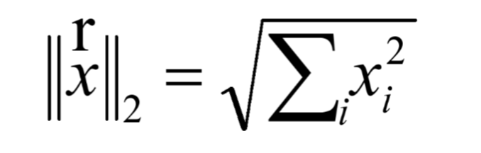

# Indice Invertido

- El inidice invertido es una tecnica utilizada en la recuperacion de informacion y de la busqueda de texto, ademas permite una búsqueda eficiente de palabras clave en grandes cantidades de texto.

## Implementación

- Implementamos la clase `InvertIndex` la cual tiene como atributos el archivo de indice, el indice, el idf y la longitud de los documentos.

``` python
class InvertIndex: 

    def __init__(self, index_file) -> None:
        self.index_file = index_file
        self.index = {}
        self.idf = {}
        self.length = {}
```
- En el funcion `load_index()` cargamos el indice invertido desde el archivo de indice el cual esta en formato json.

``` python
    def load_index(self, index_file) -> None:
        try:
            with open(index_file, 'r') as f:
                data = json.load(f)
                self.index = data['index']
                self.idf = data['idf']
                self.length = data['length']
        except FileNotFoundError:
            print("El archivo de índice no existe. Debe construirlo primero usando la función `building`.") 
```

- En la funcion `building()` construimos el indice invertido a partir de los documentos que se encuentran en la carpeta `docs` y lo guardamos en el archivo `index.json`, esto lo realizamos con el proposito de evitar recalculos al momento de querer usar el indice invertido , es decir, lo calculamos una vez y lo guardamos para una futura utilizacion del mismo, ademas que si el indice invertido es muy grande no se podria tener en memoria principal `(RAM)`, por ello se lleva a memoria secundaria.

``` python
    def building(self, collection_text) -> None:
        # Procesamiento en paralelo
        def process_file(file_name):
            with open(os.path.join("books", file_name), 'r') as file:
                texto = file.read().rstrip()
                return preprocesamiento(texto)

        # Procesamiento paralelo para leer y preprocesar los documentos eficientemente
        with concurrent.futures.ThreadPoolExecutor() as executor:
            textos_procesados = list(executor.map(process_file, collection_text))

        # compute the tf
        self.index=tf_dic(tf(textos_procesados,collection_text))

        # compute the idf
        self.idf=idf_dic(df(textos_procesados),len(textos_procesados))
    
        # compute the length (norm)
        self.length=norma(self.index,self.idf,collection_text)

        # store in disk
        data = {
            'index': self.index,
            'idf': self.idf,
            'length': self.length
        }
        with open(self.index_file, 'w') as f:
            json.dump(data, f)
```
- En la funcion `validate_query()` validamos si los terminos de la query se encuentran en el indice invertido, esto lo realizamos con el proposito de evitar errores al momento de querer calcular la similitud coseno, ya que si un termino no se encuentra en el indice invertido no se podria calcular la similitud coseno. AL final devolvemos solo los terminos que se encuentran en el indice invertido.
```python
    def validate_query(self, query_term_unic) -> set:
        aux = set()
        for term in query_term_unic:
        # Validamos si existe el término en nuestros diccionarios
            if term in self.idf:
                aux.add(term)
        return aux
```
- En la función `retriveral()` hallamos la similitud coseno a partir de los diccionarios de los pesos tf y idf, en donde iteramos a travez los keywords de la query y buscamos los concidentes con cada documento de la coleccion, luego calculamos el peso tf-idf y asignamos el `score` correspondiente a cada documento.

``` python
    def retrieval(self, query, k) -> list:
        self.load_index(self.index_file)
        # preprocesar la query: extraer los terminos unicos
        queryPrep = preprocesamiento(query)
        query_term_unic=set(queryPrep)

        # diccionario para el score
        score = {}
        # aplicar similitud de coseno y guardarlo en el diccionario score
        for key in self.length.keys():
            score[key] = 0
        #validamos si existe el termino en nuestros diccionarios
        query_term_unic=self.validate_query(query_term_unic)
        if(len(query_term_unic)==0):
            return score

        lenght_query=[]

        for term in query_term_unic:
            # calcular el tf-idf del query
            term_tf = math.log10(1+queryPrep.count(term))
            term_idf = self.idf[term]
            term_doc = self.index[term]

            lenght_query.append(term_tf*term_idf)

            for doc in term_doc:
                w_td = self.index[term][doc]*term_idf
                w_tq = term_tf*term_idf
                score[doc] += w_td * w_tq

        norma_query=np.linalg.norm(np.array(lenght_query))

        for doc in score:
            score[doc] /= (self.length[doc]*norma_query)
            score[doc] = round(score[doc], 2)


        # ordenar el score de forma descendente
        result = sorted(score.items(), key= lambda tup: tup[1], reverse=True)
        # retornamos los k documentos mas relevantes (de mayor similitud al query)
        return result[:k] 
```


- Como funciones externas a la clase `InvertIndex` tenemos las siguientes:

  - `tf()` la cual calcula el tf de cada palabra en cada documento, es decir la frecuencia de cada palabra en cada documento.

    ``` python
    def tf(books, textos) -> dict:
        frecuencia = defaultdict(lambda: defaultdict(int))

        for i, libro in enumerate(books):
            for token in libro:
                frecuencia[token][textos[i]] += 1
        
        return dict(frecuencia)
    ```
  - `tf_dic()` es esta funcion normalizamos los pesos tf de cada palabra en cada documento,esto lo realizamos aplicando la funcion `math.log10()`, la cual calcula el logaritmo en base 10.

    ``` python
    def tf_dic(tf) -> dict:
        for token, books in tf.items():
            for book, freq in books.items():
                books[book] = math.log10(1 + freq)
        return tf
    ```     

  - `df()` la cual calcula el df de cada palabra, es decir la cantidad de documentos en los que aparece cada palabra.

    ``` python
    def df(books) -> dict:
        pesos = defaultdict(int)

        for libro in books:
            for token in set(libro):
                pesos[token] += 1

        return dict(pesos)
    ```
  - `idf_dic()` en esta funcion hallamos el peso idf de cada palabra, asi como tambien la normalizacion la cual realizamos a travez de la funcion `math.log10()`.

    ``` python
    def idf_dic(df, num_textos) -> dict:
        div = math.log10(num_textos)
        for token in df:
            df[token] = div - math.log10(df[token])
            # df[token] = math.log10(num_textos / df[token])
        return df
    ```

  - `norma()` en esta funcion hallamos la norma de un documento, la cual consiste en la raiz cuadrada de la sumatoria de los cuadrados de cada valor de frecuencia de los terminos de un documento, esto lo determinamos de manera mas simplificada con la funcion `np.lialg.norm`.

     

    ``` python
    # La norma se saca a partir de los pesos tf-idf
    def norma(tf, idf, collection_text) -> dict:
        length = {}

        TF_IDF = np.array([[tf[token][book] * idf[token] for token in tf] for book in collection_text])

        for i, book in enumerate(collection_text):
            length[book] = np.linalg.norm(TF_IDF[i])

        return length
    ```  
