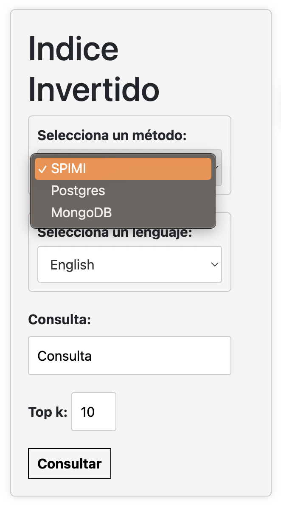
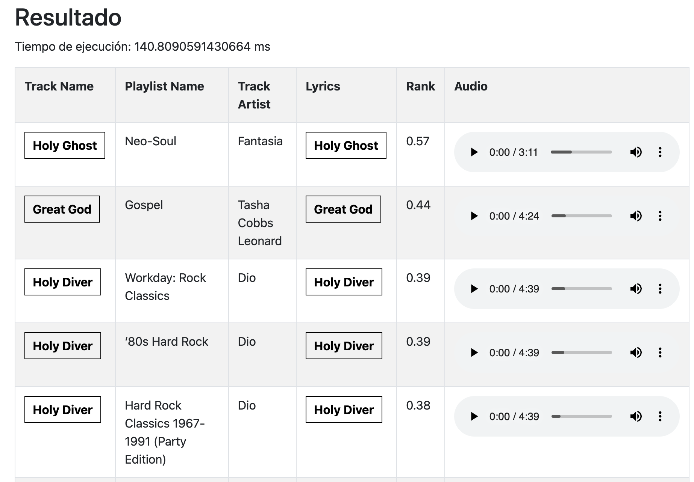
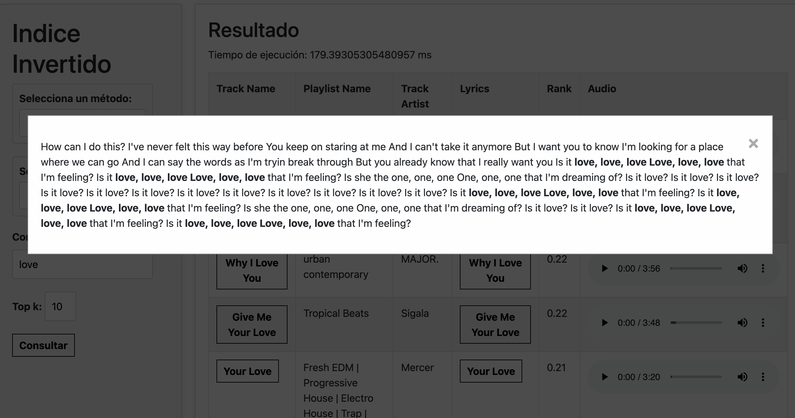
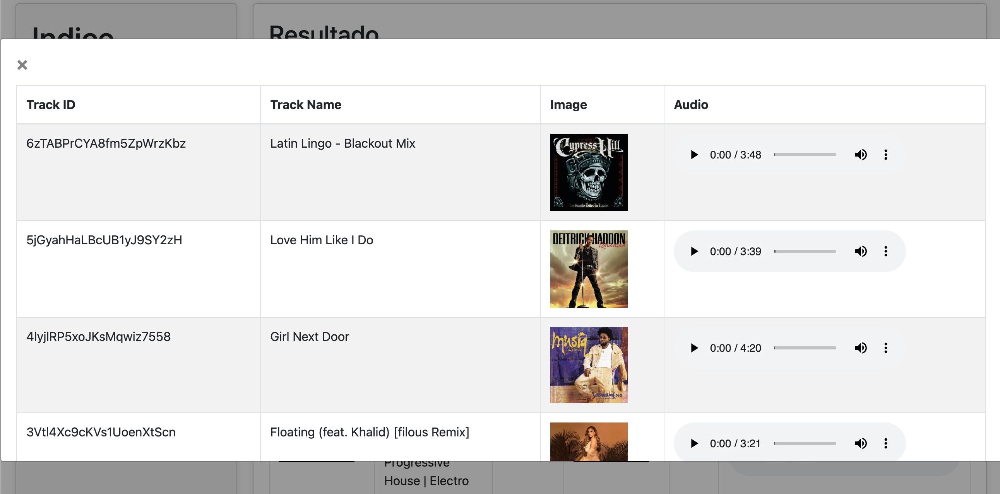

# Knn-ciones

Aplicación Web que muestra canciones en base al parecido textual y multimedia. El total de canciones son aproximadamente 15 mil canciones obtenidas de Spotify.

## Instalación
Creamos un ambiente virtualizado
```bash
python3 -m venv venv
```

Instalamos los requirements para el proyecto
```bash
pip3 install -r "requirements.txt"
```

## Uso

En primer lugar, debemos seguir los pasos de las siguientes guías:

- [Construir SPIMI](https://github.com/MatiasMaravi/BD2-Project2/blob/main/assets/docs/Documentacion_indice_invertido.md)
- [Construir base de datos en PostgreSQL](https://github.com/MatiasMaravi/BD2-Project2/blob/main/assets/docs/guia_sql.md)
- [Construir base de datos en MongoDB](https://github.com/MatiasMaravi/BD2-Project2/blob/main/assets/docs/Indice_invertido_mongodb.md)

Cabe resaltar que se usa el archivo **new_spotify_songs.csv** para poblar cada base de datos.

Luego de realizar los pasos previos, ejecutamos el siguiente código en Bash para hacer uso de la aplicación:
```bash
python3 app.py   
```

## Funcionalidades


### Formulario para realizar consulta



### Muestra resultados de consulta textual



### Podemos ver la letra de la cancion




### Consultamos los mas parecidos en multimedia





## Recursos

### API de Spotify:
Utilizamos la API para obtener las imagens de las canciones apsandole el track_id

[Soptify developers](https://developer.spotify.com/documentation/web-api)


